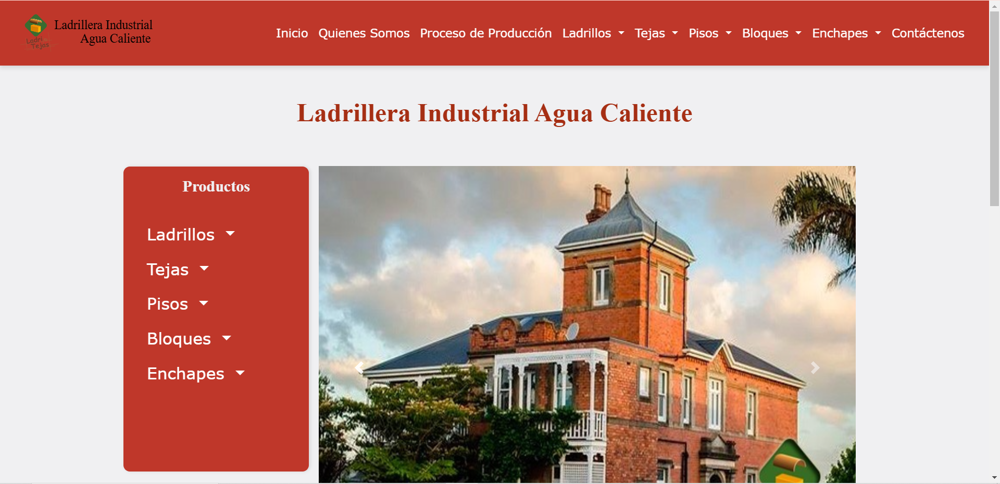

# 🧱 Ladrillera Industrial - Sitio Web Informativo

Sitio web desarrollado para mostrar los servicios, información corporativa y presencia digital de una empresa del sector industrial.

## 🌐 Demo

🔗 https://ladrillera-industrial-agua-caliente.netlify.app/

## 📸 Vista previa

---

## 🚀 Tecnologías utilizadas

- HTML5
- CSS3
- Bootstrap
- JavaScript
- Responsive Design

---

## ✨ Características

✔ Diseño moderno y responsive  
✔ Sección de servicios
✔ Sección de productos
✔ Información corporativa 
✔ Información de contácto
✔ Optimización para distintos dispositivos  
✔ Navegación intuitiva  

---

## 🧠 Lo que aprendí

- Maquetación con Bootstrap
- Diseño responsive
- Estructuración de sitios informativos
- Buenas prácticas en UI

---

## 👨‍💻 Autor

**Kendall Campos Ramírez**

- 💼 Portafolio: https://TU-PORTAFOLIO
- 🐙 GitHub: https://github.com/TU-USUARIO
- 💼 LinkedIn: https://www.linkedin.com/in/kendall-campos-ram%C3%ADrez-b19416268/
